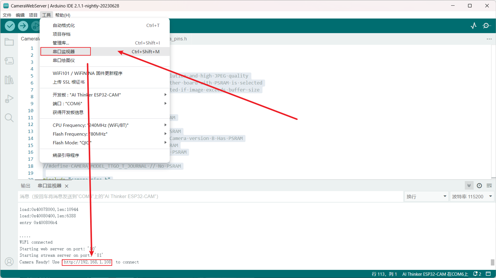

# ESP32Cam 摄像头实时查看
## ESP32cam 介绍

ESP32-CAM是小尺寸的摄像头模组该模块可以作为最小系统独立工作，尺寸仅为 `27*40.5*4.5mm`，可广泛应用于各种物联网场合，适用于家庭智能设备、工业无线控制、无线监控、QR无线识别，无线定位系统信号以及其它物联网应用，是物联网应用的理想解决方案。[^1]

其产品特性如下：

- 采用低功耗双核32位CPU，可作应用处理器
- 主频高达240MHz，运算能力高达 600 DMIPS
- 内置 520 KB SRAM，外置8MB PSRAM
- 支持UART/SPI/I2C/PWM/ADC/DAC等接口
- 支持OV2640和OV7670摄像头，内置闪光灯
- 支持图片WiFI上传
- 支持TF卡
- 支持多种休眠模式。
- 内嵌Lwip和FreeRTOS
- 支持 STA/AP/STA+AP 工作模式
- 支持 Smart Config/AirKiss 一键配网
- 支持二次开发

ESP32cam 的接口引脚图如下所示：


## arduino IDE
1. 安装 arduino IDE
下载官方网址：https://www.arduino.cc/en/software, 下载符合自己操作系统版本的IDE并安装。
2. arduino IDE 获取 ESP32 开发环境，由于 arduino IDE 中本身是没有 ESP32 的开发版，需要手动进行安装，安装方式如下：

    打开 Arduino IDE ，找到 文件>首选项 ,将 ESP32 的配置链接填入附加开发板管理网
    ```
    # 配置链接
    https://dl.espressif.com/dl/package_esp32_index.json
    ```

## 运行代码
1. 选择 文件>示例>ESP32>Camera>CameraWebServer ,进入示例代码界面。

2. 修改示例代码中的相关参数。
- 修改示例代码中的 wifi 和密码的名称。
- 修改示例代码中的摄像头类型为 `CAMERA_MODEL_AI_THINKER` 。


3. 运行结果
上传成功后，按一下 ESP32cam 开发板上的 RST 按键 ，重新启动开发板。
选择 工具>串口监视器，查看串口中输出的 ip，并用浏览器打开 ip 即可实时查看视频画面

